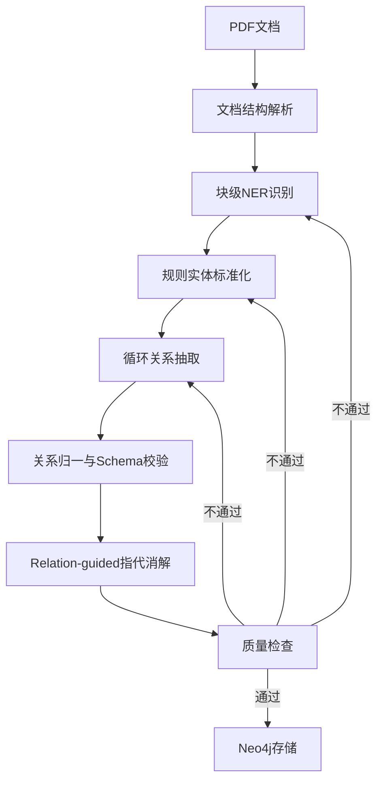
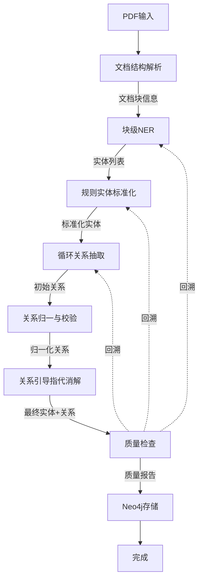

## 产品概述

重构法律文书知识图谱构建流水线，将现有的5步流水线（NER → Coref → Normalization → Relation → QA）升级为7步新架构，提升抽取准确性和系统可维护性。新架构采用规则化、模块化设计，降低对LLM的依赖，引入文档结构理解和关系引导的图推理技术。

## 核心功能

- **文档结构解析**：识别法律文书特有章节结构（如'案件事实'、'判决理由'、'诉讼请求'等），使用规则+模板匹配方法进行解析
- **块级NER识别**：基于文档块进行实体识别，支持9种实体类型（Case、Court、Judge、Party、Law、Evidence、LegalTerm、Date、Amount）
- **规则实体标准化**：使用 pkuseg + 规则 + 词典进行实体归一化，完全替代现有LLM归一化
- **循环关系抽取**：采用迭代方式抽取实体关系，支持复杂关系的逐步发现
- **关系归一与Schema校验**：对抽取的关系进行归一化处理，并验证是否符合预定义的关系模式
- **Relation-guided指代消解**：基于已抽取的关系而非文本进行实体对齐，提升指代消解准确性
- **Neo4j存储集成**：保持现有存储接口不变，自动构建和存储知识图谱
- **质量检查重构**：适配新流程的QA逻辑，支持7步流水线的质量评估和回溯机制

## 技术栈

- **核心框架**：LangGraph（状态机编排）+ LangChain（LLM集成）
- **中文分词**：pkuseg（规则实体标准化）
- **PDF处理**：PyMuPDF（文档结构解析）
- **图数据库**：Neo4j（知识图谱存储）
- **数据处理**：Pydantic（数据验证）
- **LLM**：DeepSeek-V3.2（仅用于部分复杂推理）

## 技术架构

### 系统架构

新架构采用模块化流水线设计，通过规则引擎减少对LLM的依赖，同时引入文档结构理解和关系引导推理提升准确性：



### 模块划分

#### 新增模块

- **文档结构解析模块**（`src/document_parser/`）
- 负责识别法律文书章节结构
- 使用规则+模板匹配提取文档块
- 依赖：PDF处理器

- **规则实体标准化模块**（`src/normalization/`）
- 基于pkuseg的中文分词
- 规则引擎进行实体合并和归一化
- 词典管理模块
- 依赖：pkuseg、实体类型定义

#### 重构模块

- **LangGraph智能体**（`src/langgraph_agents/`）
- 重构NERAgent为块级处理
- 重构RelationAgent为迭代抽取
- 重构CorefAgent为关系引导消解
- 新增RelationNormalizationAgent
- 重构QualityCheckAgent适配新流程

- **状态定义**（`src/langgraph_agents/state.py`）
- 扩展状态以支持文档块信息
- 添加关系归一化结果字段

### 数据流

**完整流水线数据流**：



**文档结构解析数据流**：

```
PDF文档 → 规则引擎识别章节 → 提取文档块（事实、理由、判决等） → 关联元数据
```

**规则实体标准化数据流**：

```
实体列表 → pkuseg分词 → 规则匹配 → 词典查询 → 实体合并 → 标准化实体
```

**Relation-guided指代消解数据流**：

```
关系三元组 + 原始实体 → 图构建 → 路径推理 → 指代消解 → 最终实体
```

### 关键算法

#### 文档结构识别算法

- 基于正则表达式匹配章节标题模式
- 使用法律文书模板库辅助识别
- 支持层级结构解析

#### 规则实体标准化算法

- pkuseg分词提取实体关键词
- 基于相似度计算的实体匹配规则
- 优先级规则的实体合并策略

#### 关系引导指代消解算法

- 基于图遍历的实体关联推理
- 使用关系路径相似度判断指代关系
- 多跳推理提升消解准确性

## 实现细节

### 核心目录结构

```
d:\AISource\hk-zzw\
├── src/
│   ├── document_parser/          # 新增：文档结构解析
│   │   ├── __init__.py
│   │   ├── parser.py             # 文档结构解析器
│   │   └── rules.py              # 章节识别规则
│   ├── normalization/             # 新增：规则实体标准化
│   │   ├── __init__.py
│   │   ├── normalizer.py          # 规则标准化引擎
│   │   ├── segmenter.py           # pkuseg分词封装
│   │   └── dictionary.py         # 实体词典管理
│   ├── langgraph_agents/
│   │   ├── graph.py              # 重构：新架构状态机
│   │   ├── state.py              # 修改：扩展状态定义
│   │   ├── ner_agent.py          # 修改：块级NER
│   │   ├── relation_agent.py     # 修改：循环关系抽取
│   │   ├── coref_agent.py        # 修改：关系引导消解
│   │   ├── relation_norm_agent.py # 新增：关系归一化智能体
│   │   └── qa_agent.py           # 重构：适配新流程
│   ├── knowledge_base/
│   │   ├── entities.py           # 保留：实体类型定义
│   │   └── schemas.py            # 保留：关系类型定义
│   ├── neo4j/
│   │   └── storage.py            # 保留：存储接口不变
│   └── pdf_processor/
│       └── extractor.py          # 保留：PDF提取
├── config/
│   └── settings.py               # 修改：新增配置项
├── requirements.txt              # 修改：添加pkuseg
└── main.py                       # 保留：主入口
```

### 关键代码结构

#### 文档块数据结构

```python
class DocumentBlock(TypedDict):
    block_id: str                 # 块唯一标识
    block_type: str               # 块类型（fact/reason/judgment等）
    title: str                    # 章节标题
    content: str                  # 块内容
    start_pos: int                # 起始位置
    end_pos: int                  # 结束位置
    metadata: Dict[str, Any]      # 元数据
```

#### 状态扩展

```python
class ExtractionState(TypedDict):
    # 原有字段
    raw_text: str
    pdf_path: Optional[str]
    entities: List[Dict[str, Any]]
    normalized_entities: List[Dict[str, Any]]
    relations: List[Dict[str, Any]]
    quality_report: Optional[QualityReport]
    # 新增字段
    document_blocks: List[DocumentBlock]      # 文档块信息
    block_entities: Dict[str, List[Dict]]    # 块级实体映射
    normalized_relations: List[Dict]          # 归一化后的关系
```

### 技术实现计划

#### 1. 文档结构解析实现

- 定义法律文书章节识别规则（正则表达式模式）
- 实现基于规则的文档块提取器
- 支持层级结构的解析和元数据关联

#### 2. 块级NER改造

- 修改NERAgent支持文档块输入
- 每个块独立执行NER，保留块级信息
- 合并块级实体结果，生成全局实体列表

#### 3. 规则实体标准化引擎

- 集成pkuseg进行中文分词
- 实现实体相似度计算规则
- 构建实体词典管理系统
- 设计优先级规则的合并策略

#### 4. 循环关系抽取

- 重构RelationAgent支持迭代抽取
- 每轮基于已有关系发现新的隐含关系
- 设置最大迭代次数和收敛条件

#### 5. 关系归一与Schema校验

- 新增RelationNormalizationAgent
- 实现关系类型归一化（同义关系合并）
- Schema校验逻辑（实体类型+关系类型验证）

#### 6. Relation-guided指代消解

- 基于关系三元组构建实体图
- 实现图遍历算法（BFS/DFS）
- 使用关系路径相似度判断指代关系

#### 7. 状态机重构

- 重新设计7步流水线的节点和边
- 调整回溯逻辑适配新流程
- 保持现有接口兼容性

### 集成点

- **文档解析与PDF处理器**：PDF提取器输出 → 文档解析器输入
- **块级NER与文档解析**：文档块 → NER输入
- **规则标准化与实体类型**：knowledge_base/entities.py定义
- **关系校验与关系模式**：knowledge_base/schemas.py定义
- **存储模块接口**：保持src/neo4j/storage.py接口不变

## 技术考量

### 日志

- 遵循现有日志模式（使用loguru）
- 为每个新模块添加详细日志记录
- 记录文档块解析、实体标准化、关系消解等关键步骤

### 性能优化

- 文档块级并行处理NER
- 实体词典缓存加速标准化
- 关系抽取迭代设置合理上限
- pkuseg分词结果复用

### 安全性

- 输入文本验证和清理
- 实体ID唯一性检查
- 关系Schema严格验证
- 防止无限循环（关系抽取、指代消解）

### 可扩展性

- 文档解析规则支持动态添加
- 实体词典支持外部配置文件
- 关系类型定义易于扩展
- 新增智能体遵循现有BaseAgent模式

## 设计风格

本项目为后端重构项目，不涉及UI设计变更。保持现有的命令行界面风格，仅输出处理进度和结果统计信息。

## 输出格式

保持简洁的文本输出，包括：

- 文档解析进度（已识别X个文档块）
- 实体抽取统计（块级实体数量）
- 标准化处理结果（合并X个实体）
- 关系抽取迭代信息（第X轮，新发现Y个关系）
- 指代消解结果（消解X个指代）
- 最终统计信息（实体数、关系数、质量评分）